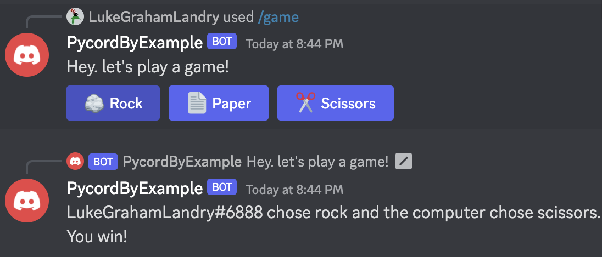

# Rock Paper Scissors

This goes over how to implement a simple [rock paper scissors](https://en.wikipedia.org/wiki/Rock_paper_scissors) game as a Slash Command. 

Here's what the result will look like. 



## Game Logic

Let's write some code to define the rules of rock paper scissors. 

I'm going to imagine I have a `Selection` class which represents a player's choice of rock, paper, or scissors. 
Defining constants like this allows your IDE to autocomplete them, so you can't accidentally misspell something later and get a confusing bug. 

```python
Selection.ROCK = Selection("rock")
Selection.PAPER = Selection("paper")
Selection.SCISSORS = Selection("scissors")
```

Now let's actually define that `Selection` class so the code compiles. 
This must go above the constant definitions we just wrote since they reference the class. 
The interpreter must know a class exists before it can be used. 

This code simply saves the string we pass in when we create the object. 

```python
class Selection:
    def __init__(self, name):
        self.name = name
```

The other advantage of making a class for this is it allows us to attach behaviour to our data. 
For example, lets start by defining a method to check if our choice ties with another choice. 
According to the rules of rock paper scissors, this is very easy. We just check if the two selections are the same. 
Make sure you put this function goes inside the class definition you made above. 

```python
def ties(self, other):
    return self == other
```

Now let's define a new method to check if our selection beats another one. If this returns true, we win! 
This method simply goes through the options for which selection we could be and checks if the other selection passed in is the one we would beat.  

Notice that if `self` is none of those three options we would fall out the end of the method and return `None`. 
That can never happen because we only ever define three `Selection` objects that can be used.  

```python
def beats(self, other):
    if self == Selection.ROCK:
        return other == Selection.SCISSORS
    elif self == Selection.PAPER:
        return other == Selection.ROCK
    elif self == Selection.SCISSORS:
        return other == Selection.PAPER
```

## Slash Command With Buttons 

Now we want to allow the user to start a Rock Paper Scissors game from within discord. 
They'll do this by typing `/game` and then clicking a button to choose which option they select. 

### UI View

This class will extend `discord.ui.View` which allows us to pass it to our slash command to define its buttons. 

Each method with the `@discord.ui.button` annotation defines a button that will show under the slash command response. 
When the button is clicked, the method will be called. 
The parameters of the annotation control how the button will look in the discord client. 
The display text will be `emoji` and then `label`. The color is decided by `style` ([see options](https://guide.pycord.dev/interactions/ui-components/buttons#button-styles)). 

Each of our buttons will simply call the `endGame` method (which we haven't defined yet) with the corresponding `Selection` object. 
We also pass it the `interaction` object which will allow us to send a response back to the user in discord. 

Notice how similar each button definition is, all we're changing is the display text and the `Selection` used.

```python
class GameView(discord.ui.View):
    @discord.ui.button(label="Rock", style=discord.ButtonStyle.primary, emoji="🪨")
    async def chooseRock(self, button, interaction):
        await endGame(interaction, Selection.ROCK)

    @discord.ui.button(label="Paper", style=discord.ButtonStyle.primary, emoji="📄")
    async def choosePaper(self, button, interaction):
        await endGame(interaction, Selection.PAPER)

    @discord.ui.button(label="Scissors", style=discord.ButtonStyle.primary, emoji="✂️")
    async def chooseScissors(self, button, interaction):
        await endGame(interaction, Selection.SCISSORS)
```

### Command

The `@bot.slash_command` annotation defines a new slash command. A user can invoke it by typing a `/` and then the `name` parameter. 
The `description` will be shown in the UI to let them know what the command does. 

The method gets called when they invoke the command. 
We respond with some text and add our buttons underneath by passing a new object of the `GameView` as the `view` parameter. 

```python
@bot.slash_command(name="game", description="Play rock paper scissors")
async def startGame(ctx):
    await ctx.respond("Hey. let's play a game!", view=GameView())
```

## End Game Logic

This function will be called when the user presses one of our buttons. 

```python
async def endGame(interaction, player_choice):
    pass
```

First, randomly choose a `Selection` for the computer to play. You must `import random` at the top of your file

```python
options = [Selection.ROCK, Selection.PAPER, Selection.SCISSORS]
computer_choice = options[random.randrange(len(options))]
```

Then, create a response string to let the user know the game state. 

The `.format` call injects its arguments in the string in place of each `{}`. 

```python
response = "{} chose {} and the computer chose {}. \n".format(interaction.user, player_choice.name, computer_choice.name)
```

Use the Game Logic methods we defined earlier to add the result of the game to the response string. 

```python
if player_choice.beats(computer_choice):
    response += "You win!"
elif player_choice.ties(computer_choice):
    response += "You tie."
else:
    response += "You lose."
```

Finally, send that response as a message to discord. You can only call `response.send_message` once, that's why we combined all the information into one string.

```python
await interaction.response.send_message(response)
```
